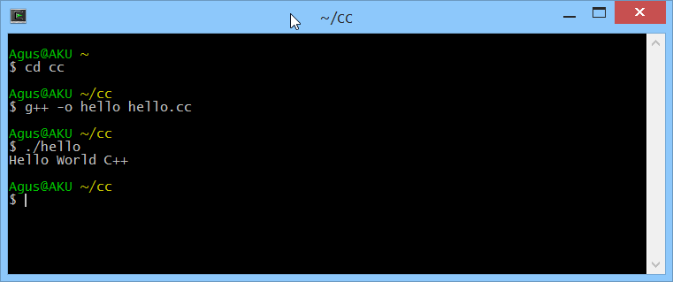

# Hello World

Ini merupakan hal yang pertama yang dilakukan ketikan membuat program awal yaitu Hello World. Disini kita menggunakan Ubuntu dan compiler GCC g++. Buat file dengan nama **hello.cc** dan tulis kode program dibawah ini.

	#include <iostream>
	
	using namespace std;
	int main()
	{
	    cout<<"Hello World C++ "<< endl;
		return 0;
	}

Silakan unduh disini [hello.cc](../src/hello.cc).

Selanjutnya untuk kompilasi dapat dilakukan sebagai berikut.

    $ g++ -o hello hello.cc

Untuk eksekusinya dapat dilakukan sebagai berikut.

    $ ./hello
    

Contoh hasilnya.

