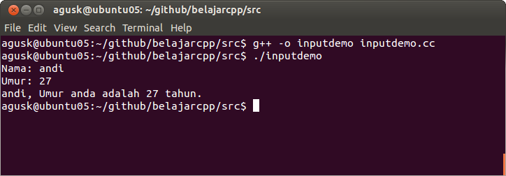

# Menerima Input Keyboard

Kita juga dapat menerima inputan dari keyboard dengan memanfaatkan fungsi cin.

Berikut ini realisasi dari penggunaan scanf ([inputdemo.cc](../src/inputdemo.cc)):

    #include <iostream>
    
    using namespace std;
    
    int main ()
    {
      char name [30];
      int age;
    
      cout<<"Nama: ";
      cin >> name;
      cout<<"Umur: ";
      cin >> age;
      cout << name << ", Umur anda adalah "<< age << " tahun." << endl;
    
      return 0;
    }

Lakukan kompilasi

	$ g++ -o inputdemo inputdemo.cc

Selanjutkan lakukan eksekusi

	$ ./inputdemo

Contoh hasil eksekusinya dapat dilihat pada gambar dibawah ini.

