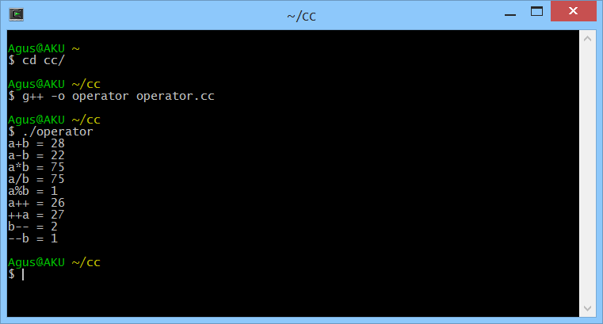
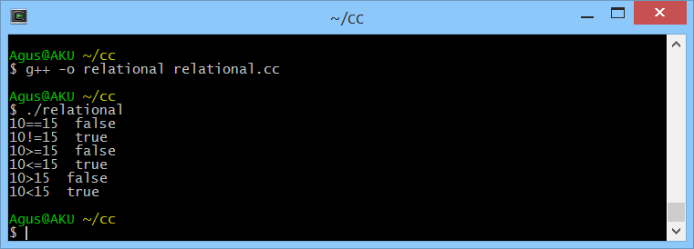

# Operator

Pada sesi ini kita akan belajar mengenai operator yang sering digunakan dalam bahasa C++. Operator ini meliputi:

* Operator Aritmatika
* Opeator Relational
* Operator Logika
* Operator Bitwise

Masing-masing operator ini akan dibahas.

## Operator Aritmatika

Operator Aritmatika digunakan untuk melakukan hal-hal yang berhubungan dengan operasi Aritmatika seperti penjumlah, pengurangan, perkalian dan pembagian. Berikut beberapa operator Aritmatika yang dapat digunakan:

* + untuk penjumlah
* - untuk pengurangan
* * untuk perkalian
* / untuk pembagian
* % untuk menghasilkan sisa dari pembagian (sisa bagi)
* ++ untuk menjumlah dengan angka 1
* -- untuk melakukan pengurangan dengan angka 1

Berikut ini contoh implementasinya ([operator.cc](../src/operator.cc)):

	#include <iostream>
	
	using namespace std;
	
	int main()
	{
	    int a = 25, b = 3;
	
	    int c = a + b;
	    cout<<"a+b = "<< c << endl;
	
	    c = a - b;
	    cout<<"a-b = "<< c << endl;
	
	    c = a * b;
	    cout<<"a*b = "<< c << endl;
	
	    float d = (float)a / b;
	    cout<<"a/b = "<< c << endl;
	
	    c = a % b;
	    cout<<"a%b = "<< c << endl;
	
	    a++;
	    cout<<"a++ = "<< a << endl;
	
	    ++a;
	    cout<<"++a = "<< a << endl;
	
	    b--;
	    cout<<"b-- = "<< b << endl;
	
	    --b;
	    cout<<"--b = "<< b << endl;
	
	
		return 0;
	}

Untuk kompilasi dan eksekusinya:

    $ g++ -o operator operator.cc
    $ ./operator

Jika sukses kita akan mendapatkan tampilan seperti dibawah ini.

## Operator Relational

Berikut ini beberapa operational relational yang dapat digunakan:

* == sama dengan
* != tidak sama dengan
* > lebih besar dari
* < kurang dari
* >= lebih besar atau sama dengan 
* <= kurang dari atau sama dengan

Untuk memudahkan pemahaman penggunaan ini, kita dapat merealisasikan dalam kode program. Contoh program ([relational.cc](../src/relational.cc)):

	#include <iostream>
	
	using namespace std;
	int main ()
	{
	   // ganti nilai ini sesuai dengan keinginan	
	   int a = 10;
	   int b = 15;
	   
	   cout<< a <<"=="<<b <<"  " <<  (a==b ? "true":"false") << endl;
	   cout<< a <<"!="<<b <<"  " <<  (a!=b ? "true":"false") << endl;
	   cout<< a <<">="<<b <<"  " <<  (a>=b ? "true":"false") << endl;
	   cout<< a <<"<="<<b <<"  " <<  (a<=b ? "true":"false") << endl;
	   cout<< a <<">"<<b <<"  " <<  (a>b ? "true":"false") << endl;
	   cout<< a <<"<"<<b <<"  " <<  (a<b ? "true":"false") << endl;
	   
	      
	   return 0;
	}

Lakukan kompilasi.

	$ g++ -o relational relational.cc

Kemudian eksekusi.

	$ ./relational

Contoh hasil ouput dapat dilihat pada gambar dibawah ini.

	
	

## Operator Logika

Ada tiga operator logika yang dapat digunakan yaitu:

* && merupakan logika AND
* || merupakan logika OR
* ! merupakan logika NOT

Contoh penggunaan operator logika dapat dilihat kode program dibawah ini ([logika.c](../src/logika.c)).

    #include <stdio.h>
 
    int main ()
    {
       // ganti nilai ini sesuai dengan keinginan	
       int a = 10;
       int b = 15;
       
       printf("(%d>%d) && (%d==%d) %s \n", a,b,a,b,(a>b) && (a==b) ? "true":"false");
       printf("(%d>%d) || (%d==%d) %s \n", a,b,a,b,(a>b) || (a==b) ? "true":"false");
       printf("!(%d>%d) && (%d==%d) %s \n", a,b,a,b,!(a>b) && (a==b) ? "true":"false");
       printf("(%d>%d) && !(%d==%d) %s \n", a,b,a,b,!(a>b) && (a==b) ? "true":"false");
       printf("!(%d>%d) || (%d==%d) %s \n", a,b,a,b,!(a>b) || (a==b) ? "true":"false");
          
       return 0;
    }

Untuk kompilasi dan eksekusinya dapat dilakukan seperti ini.

    $ gcc -o logika logika.c
    $ ./logika
    
Contoh outputnya:

    $ ./logika 
    (10>15) && (10==15) false 
    (10>15) || (10==15) false 
    !(10>15) && (10==15) false 
    (10>15) && !(10==15) false 
    !(10>15) || (10==15) true 

    

## Operator Bitwise

Operator bitwise digunakan untuk operasi biner. Berikut ini operasi bitwise:

* & merupakan operasi bitwise untuk AND
* | merupakan operasi bitwise untuk OR
* ^ merupakan operasi bitwise untuk XOR
* ~ merupakan operasi bitwise untuk binary ones Complement
* << merupakan operasi bitwise untuk binary left shift
* >> merupakan operasi bitwise untuk binary right shift

Sebagai ilustrasi, misalkan A = 10 maka binernya adalah 1010 dan B = 21 maka binernya adalah 10101. Disini kalau dilakukan operasi bitwise AND maka ini akan menjadi:

	A=10	 1010
	B=21	10101
	------------------ AND
			00000

Untuk contoh dalam kode program, kita dapat menggunakan kode program dibawah ini ([bitwise.c](../src/bitwise.c)).

    #include <stdio.h>
     
    int main ()
    {
       // ganti nilai ini sesuai dengan keinginan	
       int a = 7;
       int b = 12;
       
       printf("%d & %d = %d \n", a,b, a & b);
       printf("%d | %d = %d \n", a,b, a | b);
       printf("%d ^ %d = %d \n", a,b, a ^ b);
       printf("~%d = %d \n", a,~a);
       printf("%d<<3 = %d \n", a,a<<3);
       printf("%d>>3 = %d \n", a,a>>3);
    
       return 0;
    }

Kompilasi dan jalankan program ini.

    $ gcc -o bitwise bitwise.c
    $ ./bitwise
    

Contoh hasil seksekusinya dapat dilihat dibawah ini

    $ ./bitwise 
    7 & 12 = 4 
    7 | 12 = 15 
    7 ^ 12 = 11 
    ~7 = -8 
    7<<3 = 56 
    7>>3 = 0 

    

